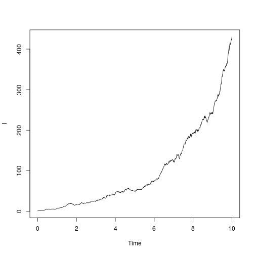
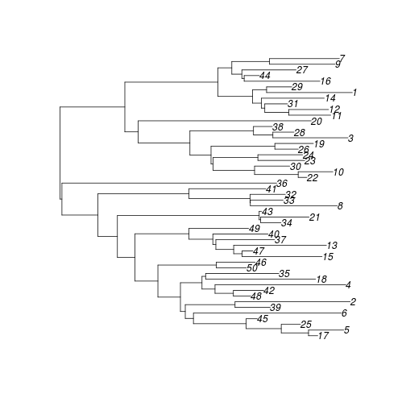

# phydynR: Coalescent simulation and likelihood for phylodynamic inference
*This project is meant to replace the Rforge rcolgem project, but is still in development.*

## Exponential growth example 
Let's model a population which is growing exponentially with fixed per-capita birth rate `beta` and death rate `gamma`. 
Once we've defined the model, we can simulate trajectories and then simulate genealogies if sampling lineages at specific times. 
Finally, we'll see how to infer birth and/or death rates if the tree is observed (e.g. reconstructed from genetic sequence data). 

First, load the package and define the rates: 

```r
require(phydynR)
```

```r
births <- c(I = 'parms$beta * I')
deaths <- c(I = 'parms$gamma * I')
```
The rates are specified as a named vector of strings; names correspond to the names of the demes (`I` in this case). 
The strings are interpreted as R expressions, so should be written just as you would write other R code. 
The keyword `parms` that appears in the rate equations is a list of parameters, which can be set as we will see below. 

Now build the demographic process like so:

```r
dm <- build.demographic.process(births = births
  , deaths = deaths
  , parameterNames = c('beta', 'gamma') 
  , rcpp = FALSE
  , sde = TRUE)
```
Note the following

* You must specify the names of parameters that appear in `parms`. 
* The `sde` option allows you to speficfy if the model is stochastic (stochastic differential equations) or deterministic (ordinary differential equations)
* the `rcpp` option says if the equations are written as R code or as C code; we used R code in this case. 

Once the model is specified, we can simulate and visualise trajectories: 

```r
show.demographic.process( dm
 , theta = list( beta = 1.5, gamma = 1 )
 , x0  = c( I = 1 )
 , t0 = 0
 , t1 = 10 
) 
```

 

* The variables `t0` and `t1` determine the time limits of integration. 

* `x0` provides a named vector of initial condition; note well that names must correspond to those used to specify the rates. 

* `theta` is a synonym for `parms` and provides the parameter list. 

You can also directly simulate the model using
```
 dm(theta, x0, t0, t1, res = 1000, integrationMethod = 'adams')
```
Here `integrationMethod` is based to the ODE solver and specifies which method to use (e.g. `euler` or `adams`). `res` is the number of time steps to use; larger values will be more accurate at expense of more computation. 

We can alternatively specify the equations as C code, in which case the model will be compiled using the `Rcpp` package. 
In this case, simulating the model will be very fast, but it will take a few seconds to compile the model. 
Let's compile a deterministic version of the model:

```r
dm.det <- build.demographic.process(births = c(I = 'beta * I')
  , deaths = c(I = 'gamma * I')
  , parameterNames = c('beta', 'gamma') 
  , rcpp = TRUE
  , sde = FALSE)
```

```
## [1] "Thu Feb 25 13:24:18 2016 Compiling model..."
## [1] "Thu Feb 25 13:24:25 2016 Model complete"
```
Note that when we use C code, the `parms` keyword is not used. 

Now let's simulate a coalescent tree conditioning on this demographic process: 

```r
tre <- sim.co.tree( list( beta = 1.5, gamma = 1 )
  , dm.det
  , x0  = c(I = 1 )
  , t0 = 0
  , sampleTimes = seq(10, 15, length.out=50)
  , res = 1000
) 
```
This is self-explanotory except for the `sampleTimes` argument, which is required. 
This specifes the times relative to `t0` that each lineage is sampled. 
The length of this vector determines the sample size. 
This can be a named vector, in which case the taxon labels are retained in the returned tree. 
The returned tree is a `DatedTree` object which subclasses `ape::phylo`. So, most of the functions in the `ape` package will also work with the simulated tree. Let's plot it: 

```r
plot(ladderize( tre ))
```

 

Finally, we will see how to compute a likelihood of parameters describing the demographic process given the tree as data. 
The `colik` function can be used to compute this likelihood, and model fitting can be done in a variety of ways; a Bayesian analysis could be done using the `mcmc` package, or maximum likelihood can be done using the `bbmle` package. 
Note that this returns the log likelihood. 
Here is an example invocation of the likelihood function using the simulated tree as data: 

```r
colik(tre
  , list( beta = 1.5, gamma = 1)
  , dm.det
  , x0 = c( I = 1 )
  , t0 = -1
  , res = 1e3
  , timeOfOriginBoundaryCondition = FALSE
)
```

```
## [1] -219.7076
```
Note the following options:

* `tre` is the `DatedTree` object that we fit to
* `x0` is the initial conditions for the demographic process
* `t0` is the time of origin of the process; you should choose a value that occurs before the root of the tree
* `res` is the number of time steps used in the demographic process
* `timeOfOriginBoundaryCondition` (default `FALSE`) : if `TRUE`, the function returns `-Inf` if the time of origin occurs before the root of the tree

The `phydynR` package also includes a convenient wrapper of R's native `optim` routines which enables easy maximum likelihood inference. Here is an example:

```r
optim.colik(tre
  , dm.det
  , start = c( beta = 2, gamma = 1, I = 1, t0 = -1)
  , est_pars = c( 'beta', 'I')
  , ic_pars = c('I')
  , t0 = -1
  , parm_lowerBounds = c( I = 0, beta = 0)
  , timeOfOriginBoundaryCondition = FALSE
  , AgtYboundaryCondition = TRUE
  , control = list()
) -> fit 
```
The return value is the same as returned by `optim`, so `fit$par` contains the parameter estimate:

```r
fit
```
```
## $par
##      beta         I 
## 1.5193956 0.4499639 
## 
## $value
## [1] 199.8921
## 
## $counts
## function gradient 
##      137       NA 
## 
## $convergence
## [1] 0
## 
## $message
## NULL
```
Note the following options:

* `start` contains the default parameter values *including* the initial conditions; this may optionally include `t0` which will specify the time of origin
* `est_pars` is a vector of parameter names that will be fitted; all remaining parameter values will be fixed at the values in `start`
* You can also fix the time of origin with the `t0` argument. 
* Some parameter values must fit within some pre-defined bounds; for example, the initial population size can not be less than zero, so the `parm_lowerBounds` is a named vector supplying the lower limits of these boundary conditions; `parm_upperBounds` provides the upper limits. 
* `control` is a list of options for `optim`; see `?optim` for more information.


## SIR example TODO 
## HIV example TODO 
